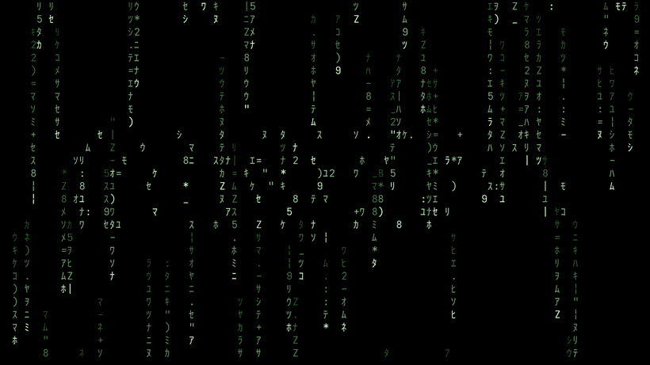
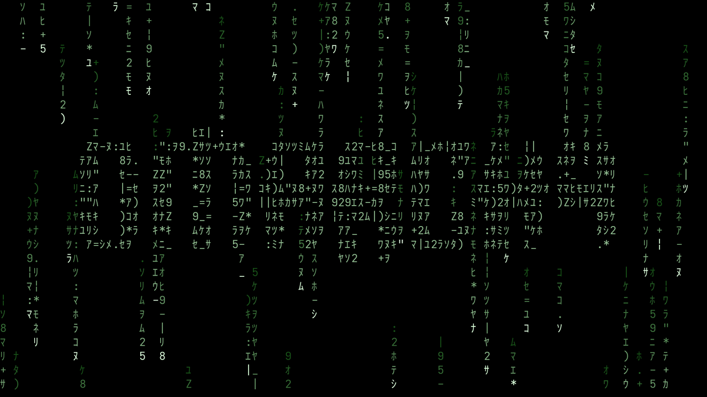

# omarchy-matrix-screensaver

A screensaver for [Omarchy](https://omarchy.org/). Falling rain slowly
traps glyphs into the Omarchy wordmark, holds it, then lets them go to fall
away again.



*Recorded with the phases compressed so a full cycle loops. The real defaults
run 90s.*

## How it runs

Four phases, in one continuous loop:

| Phase | Default | What happens |
|------:|--------:|--------------|
| Rain lead | 8s | Ordinary rain, nothing trapped |
| Forming | to 60s | Each cell of the wordmark traps a glyph at its own random moment |
| Hold | 20s | The wordmark stands, glyphs still cycling in place |
| Dissolve | 10s | Glyphs come loose in random order and fall away as rain |

Trapped glyphs look exactly like falling ones — the wordmark reads only through
motion, so a still frame is subtle by design:



## Install

```bash
git clone https://github.com/etyurkin/omarchy-matrix-screensaver
cd omarchy-matrix-screensaver
./install.sh
```

To see it right away:

```bash
omarchy-launch-custom-screensaver force
```

Otherwise it runs at your normal idle timeout (`idle.screensaver` in
`~/.config/omarchy/shell.json`). Needs `python3` and `ttfx`, both present on
a stock Omarchy install. The installer backs up anything it replaces.

## Tuning

| Variable | Default | Meaning |
|----------|--------:|---------|
| `OMARCHY_MATRIX_RAIN_LEAD` | 8 | Pure rain before anything traps |
| `OMARCHY_MATRIX_FORM_TIME` | 60 | Until the wordmark is complete |
| `OMARCHY_MATRIX_HOLD_TIME` | 20 | How long it stands |
| `OMARCHY_MATRIX_DISSOLVE_TIME` | 10 | How long it takes apart |
| `OMARCHY_MATRIX_TRAP_FADE` | 1.2 | Seconds a trapped glyph cools to green |
| `OMARCHY_MATRIX_SWAP` | 0.005 | Chance any glyph re-rolls per tick |
| `OMARCHY_MATRIX_FPS` | 30 | Frame rate |
| `OMARCHY_MATRIX_COLORS` | green | Palette: `green`, `cyan`, `violet`, `neon`, a named mix like `cyberpunk`, or your own like `cyan-green` — each stream picks one at birth |

Renders in under 2ms/frame at 1080p even at its busiest, so it stays in the
low single digits of one core.

## Other screensavers

The picker comes with it, so `omarchy-matrix` need not be the only choice:

```bash
omarchy-screensaver-list          # everything available
omarchy-screensaver-set random    # rotate through effects at random
omarchy-menu-screensaver          # pick from the Omarchy menu
```

## Colors

The palette persists the same way the effect choice does:

```bash
omarchy-screensaver-colors            # list palettes and named mixes
omarchy-screensaver-colors cyberpunk  # cyan, violet, and neon rain side by side
omarchy-screensaver-colors green      # back to classic matrix
```

`cyberpunk` matches the cyberpunk Omarchy theme's accent colors. The
`OMARCHY_MATRIX_COLORS` environment variable still wins when set.

## What it touches

All user-owned — nothing under `/usr/share/omarchy`, so `omarchy update` will
not clobber it.

```
~/.local/bin/omarchy-*                       renderer, launcher, picker
~/.config/omarchy/branding/screensaver.txt   the wordmark
~/.config/omarchy/plugins/<user>.idle        cloned idle service
~/.config/omarchy/hooks/post-update.d/       keeps that clone in sync
```

The idle service is cloned because Omarchy hardcodes the screensaver launcher in
its `Service.qml`, does not expose it in `shell.json`, and puts
`/usr/share/omarchy/bin` ahead of `~/.local/bin` on `PATH`. The clone differs
from stock by one line, and the post-update hook re-applies that line after each
update so the clone keeps getting upstream fixes.

## Uninstall

```bash
./uninstall.sh
```

Restores the stock idle service and stops using this effect.

## License

MIT. Parts are adapted from [Omarchy](https://github.com/basecamp/omarchy),
also MIT — see [LICENSE](LICENSE).
